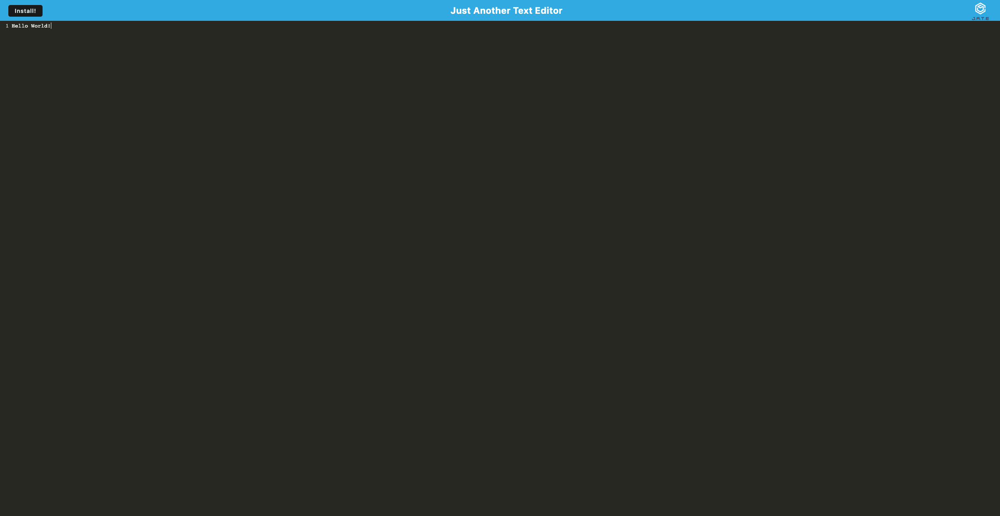

# Text-Editor

## Description

### The Text-Editor application is a Progressive Web Application (pwa) that uses indexedDB in order to store data locally. The application also has the capability to run while offline.

## Location

> 

> [repo link](https://github.com/schaparro08/Text-Editor)

> [Heroku Link](https://mysterious-wildwood-19070.herokuapp.com/) 

# Table of contents 

1. [Description](#description)

2. [Location](#location)

3. [Licenses](#licenses)

4. [Installation](#installation)

5. [Questions](#questions)

## licenses 

## Installation
Commands needed to install dependancies: 
Please run the command: npm i
Followed by: npm run start:dev          

Additonal instructions:
Please run the command npm i in the terminal and npm run start:dev     
## Questions
 ### Stephanie Chaparro-Roldan
### schaparro2021@gmail.com

>GitHub username: schaparro08